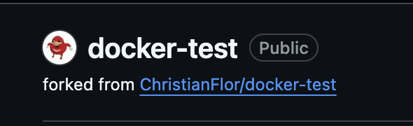
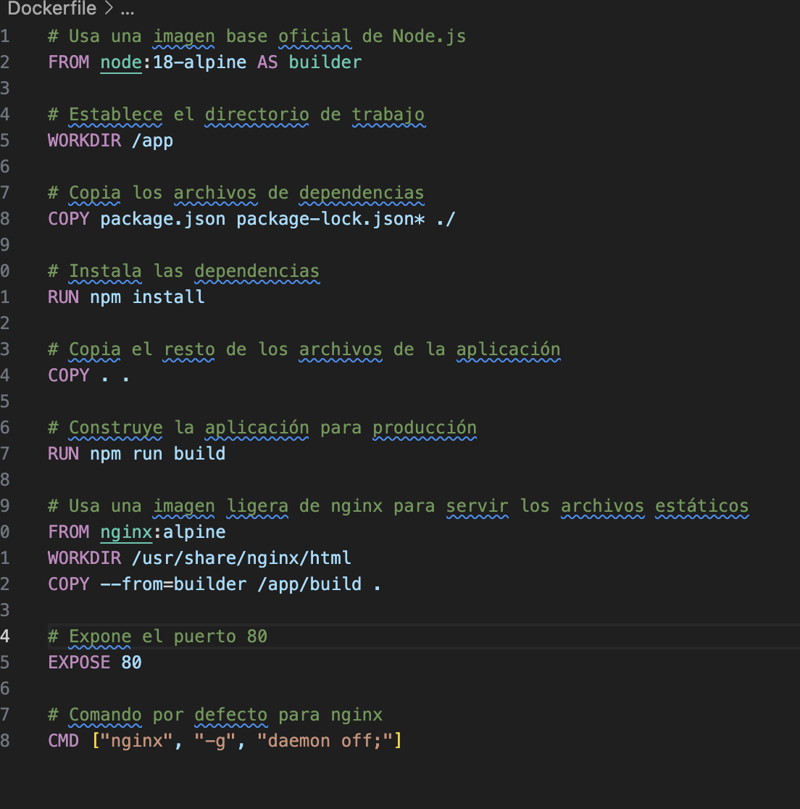
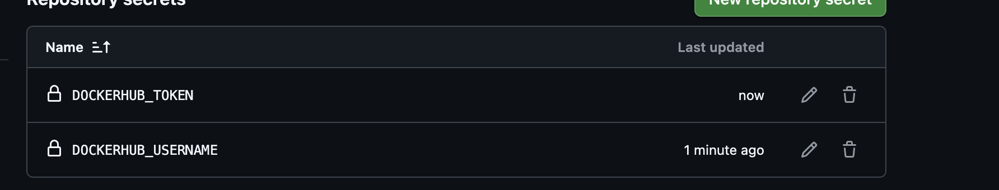
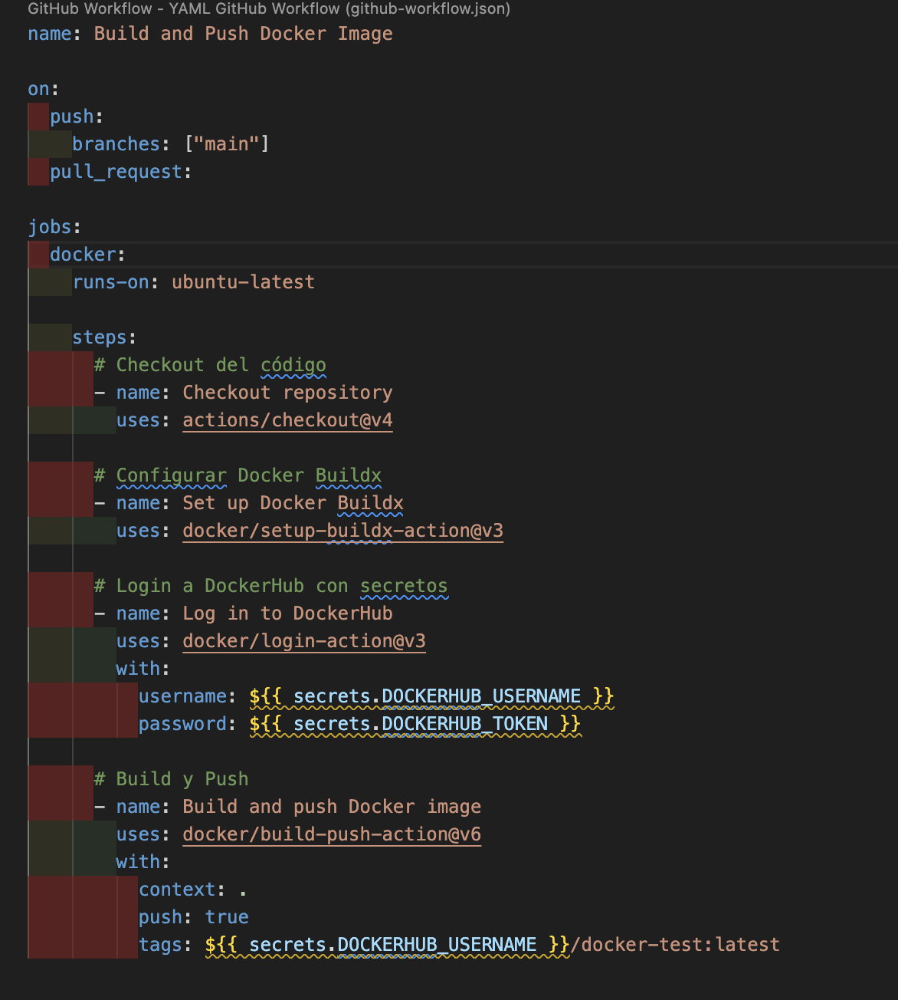
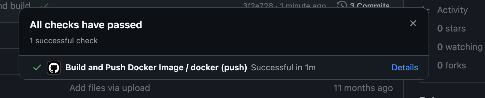
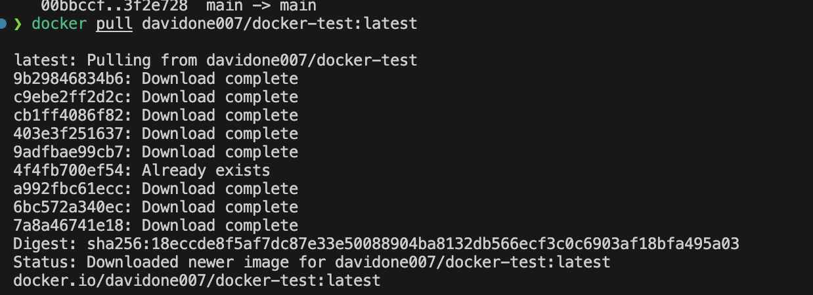
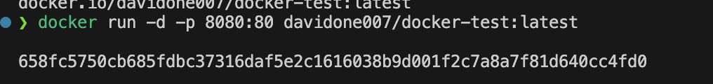
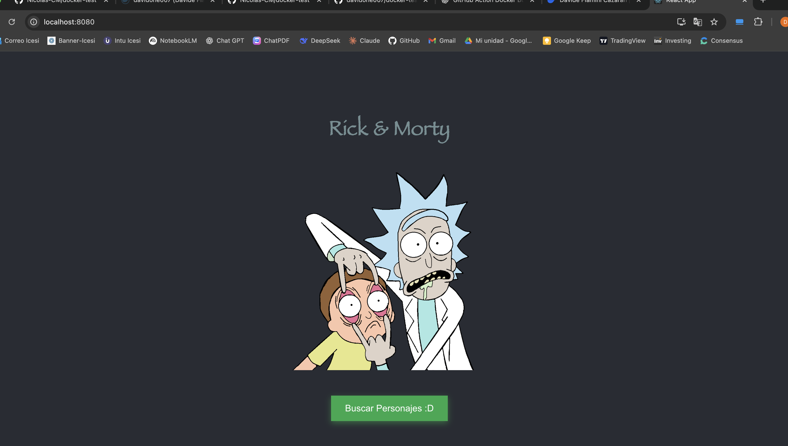

# Rick & Morty App con Docker y GitHub Actions

Este proyecto es una aplicación React que muestra personajes de Rick & Morty, implementada con Docker y despliegue automatizado usando GitHub Actions.

## Descripción del Proyecto

Aplicación web desarrollada con React que consume la API de Rick & Morty para mostrar información de los personajes. El proyecto incluye:

- Interfaz de usuario responsive
- Consumo de API externa (Rick & Morty API)
- Containerización con Docker
- CI/CD automatizado con GitHub Actions
- Despliegue en DockerHub

## Capturas de Pantalla

### 1. Fork del Repositorio


### 2. Configuración del Dockerfile


### 3. GitHub Actions - Configuración de Secretos


### 4. GitHub Actions - Workflow


### 5. Ejecución del Pipeline


### 6. Build Exitoso


### 7. DockerHub - Imagen Publicada


### 8. Aplicación en Funcionamiento


## Proceso de Implementación

### 1. Fork del Repositorio
Se realizó un fork del repositorio original para crear una copia personal donde implementar las mejoras.

### 2. Construcción del Dockerfile
Se creó un Dockerfile multi-stage que:
- Utiliza Node.js 18 Alpine para el build
- Instala dependencias y construye la aplicación
- Usa Nginx Alpine para servir los archivos estáticos
- Expone el puerto 80

```dockerfile
# Usa una imagen base oficial de Node.js
FROM node:18-alpine AS builder

# Establece el directorio de trabajo
WORKDIR /app

# Copia los archivos de dependencias
COPY package.json package-lock.json* ./

# Instala las dependencias
RUN npm install

# Copia el resto de los archivos de la aplicación
COPY . .

# Construye la aplicación para producción
RUN npm run build

# Usa una imagen ligera de nginx para servir los archivos estáticos
FROM nginx:alpine
WORKDIR /usr/share/nginx/html
COPY --from=builder /app/build .

# Expone el puerto 80
EXPOSE 80

# Comando por defecto para nginx
CMD ["nginx", "-g", "daemon off;"]
```

### 3. GitHub Action - CI/CD Pipeline
Se implementó una GitHub Action que incluye los siguientes pasos:

#### Componentes de la Action:
- **Checkout**: Descarga el código del repositorio
- **Docker Setup Buildx**: Configura Docker Buildx para builds avanzados
- **Docker Login**: Autenticación en DockerHub usando secretos de GitHub
- **Docker Build and Push**: Construye y publica la imagen en DockerHub

#### Secretos de GitHub Configurados:
- `DOCKERHUB_USERNAME`: Usuario de DockerHub
- `DOCKERHUB_TOKEN`: Token de acceso de DockerHub

## Scripts Disponibles

En el directorio del proyecto, puedes ejecutar:

### `npm run dev`
Ejecuta la aplicación en modo desarrollo.\
Abre [http://localhost:3000](http://localhost:3000) para verla en el navegador.

### `npm test`
Lanza el test runner en modo interactivo.

### `npm run build`
Construye la aplicación para producción en la carpeta `build`.

### Ejecución con Docker

```bash
# Construir la imagen localmente
docker build -t rick-morty-app .

# Ejecutar el contenedor
docker run -p 80:80 rick-morty-app
```

## Tecnologías Utilizadas

- **React 18**: Framework de frontend
- **Rick & Morty API**: Fuente de datos de personajes
- **Docker**: Containerización
- **GitHub Actions**: CI/CD
- **DockerHub**: Registro de imágenes
- **Nginx**: Servidor web para producción

## Estructura del Proyecto

```
├── public/                 # Archivos públicos
├── src/
│   ├── components/        # Componentes React
│   │   └── Characters.js  # Componente de personajes
│   ├── img/              # Imágenes
│   ├── App.js            # Componente principal
│   ├── App.css           # Estilos principales
│   └── index.js          # Punto de entrada
├── .github/
│   └── workflows/
│       └── docker-build-push.yml  # GitHub Action
├── Dockerfile            # Configuración de Docker
└── package.json         # Dependencias y scripts
```

## Funcionalidades

1. **Pantalla Principal**: Muestra el logo de Rick & Morty con botón para buscar personajes
2. **Lista de Personajes**: Muestra tarjetas con información de cada personaje:
   - Imagen del personaje
   - Nombre
   - Estado (Vivo/Muerto) con indicador visual
   - Número de episodios
   - Especie
3. **Navegación**: Botón para volver a la pantalla principal
4. **Responsive**: Adaptado para dispositivos móviles

## Despliegue Automatizado

El proyecto utiliza GitHub Actions para automatizar:
- Build de la aplicación React
- Construcción de la imagen Docker
- Push automático a DockerHub
- Activación en cada push a la rama `main`

